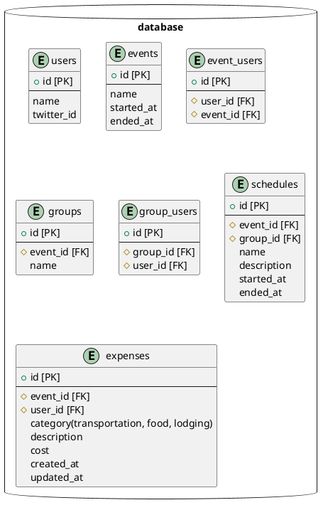

# スキーマ設計

```plantuml
@startuml

package database <<Database>> {
  entity users {
    + id [PK]
    ---
    name
    twitter_id
  }

  entity events {
    + id [PK]
    ---
    name
    started_at
    ended_at
  }

  entity event_users {
    + id [PK]
    ---
    # user_id [FK]
    # event_id [FK]
  }

  entity groups {
    + id [PK]
    ---
    # event_id [FK]
    name
  }

  entity group_users {
    + id [PK]
    ---
    # group_id [FK]
    # user_id [FK]
  }

  entity schedules {
    + id [PK]
    ---
    # event_id [FK]
    # group_id [FK]
    name
    description
    started_at
    ended_at
  }

  entity expenses {
    + id [PK]
    ---
    # event_id [FK]
    # user_id [FK]
    category(transportation, food, lodging)
    description
    cost
    created_at
    updated_at
  }
}

@enduml
```
