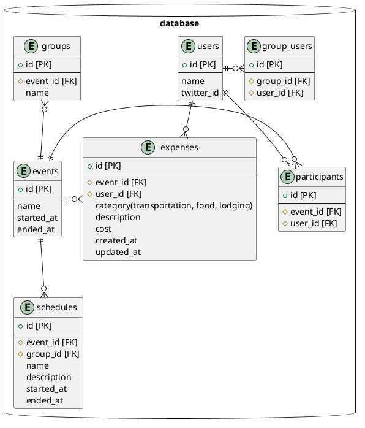

# スキーマ設計

## `users`テーブル

ユーザー情報を管理する
Twitterのアカウントの紐付けもここで管理

## `events`テーブル

イベントを管理する

## `participants`テーブル

イベントに参加するユーザーを管理する

## `groups`テーブル

イベントごとにあるグループを管理する

## `group_users`テーブル

グループに所属するユーザーを管理する

## `schedules`テーブル

スケジュールを管理する

## `expenses`テーブル

イベントごとにかかったそれぞれの費用を管理する
